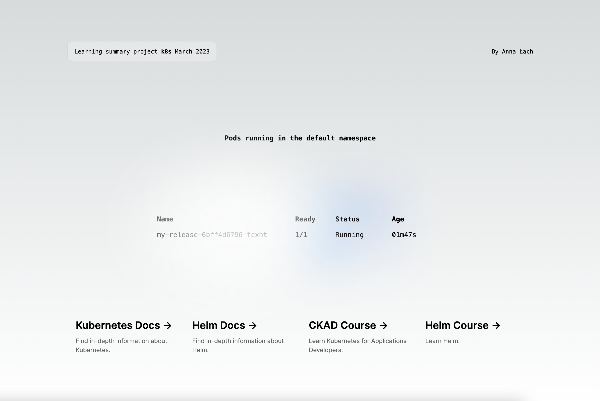

# Learning summary project k8s March 2023

## Prerequisites

- Docker >= 20.10.23
- Minikube >= 1.29.0
- Kubernetes >= 1.26.1
- Helm >= 3.11.2

## Deploy to Minikube

1. Build a docker image

```
docker build -t myapp:0.1.0 -f app/Dockerfile app
```

2. Load the image into Minikube

```
minikube image load myapp:0.1.0
```

3. Install the Helm chart with the app

```
helm install my-release chart --values=values.yaml
```

4. Wait for the "Running" state

```
kubectl get po
```

## Visit the app via your browser

Get a URL to connect to the NodePort service
```
minikube service my-release
```


